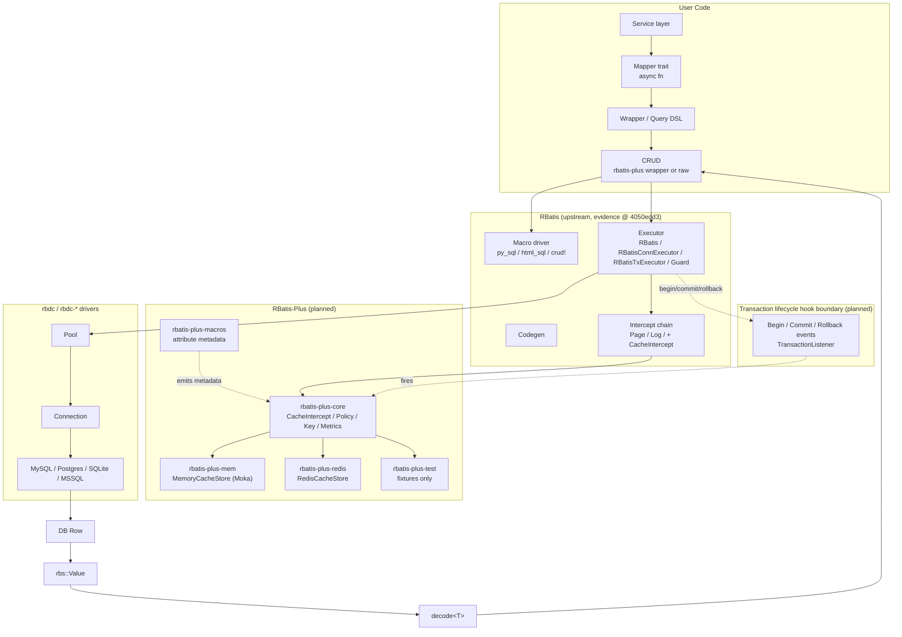

# RBatis-Plus

> An opt-in ORM L2 (result) cache product layered on top of [RBatis](https://github.com/rbatis/rbatis), with a thin upstream hook surface and feature-rich Plus-side backends.

**Status:** DESIGN / PLANNING ONLY. Nothing in this repository is implemented yet. All crate names, module paths, type names, feature flags, dependencies, Mermaid diagrams, and code snippets in this README and in `docs/` are proposed designs. No Rust workspace exists in this folder today.

- Date: 2026-07-24
- Upstream evidence baseline: RBatis `master` @ `4050edd3dad03a113b8bb4f5818a006f11f2da78`
- Latest surveyed commit title: `Limit decode fallback to single-column values`
- CodeGraph current stats (baseline): 178 files, 1,740 nodes, 17,805 edges, 192 classes, 715 functions, 655 tests; edge breakdown includes 9,366 `CALLS` and 5,524 `TESTED_BY`; 88 flows, 14 communities.

---

## Why

RBatis does not ship an ORM-level L2 cache. The "cache" you can find today is the prepared-statement cache inside `rbdc-*` drivers, plus historical SQL/parse caches — none of which is a cross-connection, cross-session query result cache. RBatis-Plus fills that gap by:

1. Asking upstream RBatis for a small, generic execution-context and transaction-lifecycle surface (so cache, tracing, metrics, tenant, audit plugins can share it).
2. Building the cache product — `CacheStore` SPI, `CacheIntercept`, policy model, key builder, in-process backend, Redis backend, macro annotations, admin helpers — entirely in RBatis-Plus.

The boundary is captured in `docs/DECISIONS.md` (ADR-001): "Upstream stays thin, RBatis-Plus carries the cache product."

---

## Planned Crate Names

The following crate names are the planned names for the multi-crate workspace. None of them exist in this folder yet.

| Crate | Role |
| --- | --- |
| `rbatis-plus` | Meta-crate; facade and re-exports |
| `rbatis-plus-core` | Policy, SPI, `CacheIntercept`, key builder, error types |
| `rbatis-plus-mem` | In-process backend (planned: Moka-based) |
| `rbatis-plus-redis` | Distributed backend (planned: Redis async client) |
| `rbatis-plus-macros` | Declarative attribute annotations (planned, Phase 5) |
| `rbatis-plus-test` | Test-support helpers and fixtures (planned, no runtime role) |

The default cache is **off**. Users opt in by installing `CacheIntercept` after their SQL-rewriting interceptors.

---

## Architecture (Planned)

The diagram below shows the planned layering from the user surface through RBatis-Plus and into upstream RBatis and `rbdc`. Boxes and edges are **planned**, not implemented.



### Plain-text flow (planned)

```
User service
   -> Mapper trait method
      -> Wrapper / Query DSL
         -> CRUD or raw query
            -> Executor::query / exec
               -> Intercept chain (Page -> ... -> CacheIntercept -> Log)
                  -> CacheIntercept: build key, hit/miss, singleflight
                     -> on hit:  return cached rbs::Value
                     -> on miss: fall through
                        -> Pool -> Connection -> rbdc driver
                           -> DB Row -> rbs::Value
                              -> decode<T> -> back to user
                                 -> CacheIntercept.after: store rbs::Value
            <- Executor returns rbs::Value
         <- Wrapper returns T
      <- Mapper returns T
   <- Service consumes T

Transaction lifecycle boundary (planned):
   Executor::begin / commit / rollback
      -> TransactionListener events
         -> CacheIntercept records pending invalidations by tx_id
            -> on commit: flush pending tags
            -> on rollback: discard pending tags
```

---

## Evidence Summary (Latest Survey)

The RBatis workspace baseline used for the latest findings is `master@4050edd3dad03a113b8bb4f5818a006f11f2da78`. The full evidence and reasoning live in [`docs/RBatis 支持二级缓存调研报告.md`](./docs/RBatis%20支持二级缓存调研报告.md). The current CodeGraph snapshot produced:

- 178 files, 1,740 nodes, 17,805 edges
- 192 classes, 715 functions, 655 tests
- 9,366 `CALLS`, 5,524 `TESTED_BY`
- 88 flows, 14 communities
- Latest commit title: `Limit decode fallback to single-column values`

What that tells us:

- The RBatis workspace layers cleanly into `runtime / macro-driver / codegen / rbdc`; caches that touch `Executor` therefore cover py_sql, html_sql, raw queries, and CRUD without per-macro patches.
- `Executor` is the unified query/exec path across `RBatis`, `RBatisConnExecutor`, `RBatisTxExecutor`, and `RBatisTxExecutorGuard`.
- CRUD is built on top of `py_sql`; SQL flows through one pipeline.
- `html_sql` carries the highest CodeGraph criticality among the macro entry points — changes here must be conservative.
- The macro driver returns a return-token string that contains the `ExecResult` payload; the executor recognises which path to take by the type token string. Cache keys therefore must be built from the **final** rewritten SQL, not the raw template.
- `PageIntercept` shares state maps keyed by executor id; cache ordering (rewriters before observers) is not optional.
- `RBatisConnExecutor::begin` **consumes** the connection. Cloning the executor and calling `begin` on a stale clone can fail because the inner `Mutex<Box<dyn Connection>>` has already been moved. This shapes how the planned transaction-lifecycle hooks must be wired.
- Transaction commit and rollback do not currently flow through any SQL `exec` interceptor; the `Intercept` API cannot observe them. A transaction lifecycle hook boundary has to be added in upstream for production-grade cache consistency.

These findings reinforce the boundary principle: **enhance `Executor` + `Intercept` + `rbs::Value` + `py_sql`** rather than rebuild the ORM.

---

## Repository Status

This folder currently contains only documentation. There is no Cargo workspace, no Rust source code, and no test infrastructure yet. Everything described above is a proposed design. Treat every Rust snippet in this README and in `docs/` as a draft, not as evidence of behavior.

---

## Documentation Index

The full documentation set lives under [`docs/`](./docs/). The nine detailed documents are kept in sync via this index.

| # | Document | Role |
| - | --- | --- |
| 1 | [`docs/RBatis 支持二级缓存调研报告.md`](./docs/RBatis%20支持二级缓存调研报告.md) | Research report on RBatis L2 cache evidence (upstream baseline) |
| 2 | [`docs/ARCHITECTURE.md`](./docs/ARCHITECTURE.md) | Planned RBatis-Plus architecture and layering |
| 3 | [`docs/IMPLEMENTATION_PLAN.md`](./docs/IMPLEMENTATION_PLAN.md) | Phased plan, PR series, test matrix, acceptance gates |
| 4 | [`docs/CACHE_SPECIFICATION.md`](./docs/CACHE_SPECIFICATION.md) | Wire protocol: keys, envelopes, codecs, tags, singleflight |
| 5 | [`docs/TRANSACTION_CONSISTENCY.md`](./docs/TRANSACTION_CONSISTENCY.md) | Transaction semantics, native vs conservative mode |
| 6 | [`docs/DECISIONS.md`](./docs/DECISIONS.md) | Architecture decision records (ADRs) |
| 7 | [`docs/INTEGRATION_GUIDE.md`](./docs/INTEGRATION_GUIDE.md) | Integration gate template and future workspace setup |
| 8 | [`docs/OBSERVABILITY_SECURITY_OPERATIONS.md`](./docs/OBSERVABILITY_SECURITY_OPERATIONS.md) | Observability, security, and operational posture |
| 9 | [`docs/TEST_AND_ACCEPTANCE_PLAN.md`](./docs/TEST_AND_ACCEPTANCE_PLAN.md) | Test matrix and release gates |

---

## Quick Links

- Research baseline: [`docs/RBatis 支持二级缓存调研报告.md`](./docs/RBatis%20支持二级缓存调研报告.md)
- Architecture: [`docs/ARCHITECTURE.md`](./docs/ARCHITECTURE.md)
- Implementation plan: [`docs/IMPLEMENTATION_PLAN.md`](./docs/IMPLEMENTATION_PLAN.md)
- Cache specification: [`docs/CACHE_SPECIFICATION.md`](./docs/CACHE_SPECIFICATION.md)
- Transactions: [`docs/TRANSACTION_CONSISTENCY.md`](./docs/TRANSACTION_CONSISTENCY.md)
- Decisions: [`docs/DECISIONS.md`](./docs/DECISIONS.md)
- Integration: [`docs/INTEGRATION_GUIDE.md`](./docs/INTEGRATION_GUIDE.md)
- Ops: [`docs/OBSERVABILITY_SECURITY_OPERATIONS.md`](./docs/OBSERVABILITY_SECURITY_OPERATIONS.md)
- Tests: [`docs/TEST_AND_ACCEPTANCE_PLAN.md`](./docs/TEST_AND_ACCEPTANCE_PLAN.md)