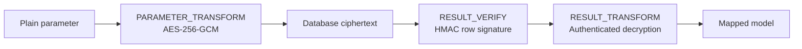

# Security model

The alpha security slice keeps database values encrypted until result
verification completes.

## Implemented invariants

- Every field encryption uses a random 96-bit nonce and authenticated context.
- Ciphertext embeds a format version and key ID; old keys remain readable during rotation.
- Blind indexes use a dedicated key and bind the table/field context.
- Row signatures use canonical JSON and fail closed on tampering or unknown keys.
- `REJECT_PARTIAL` rejects projections that cannot be verified.
- `DEFERRED_RESIGN` explicitly reports an unverifiable partial projection.
- Old valid signature keys return `VerifiedNeedsResign`.
- Keys are excluded from `Debug` output and zeroized when their owners are dropped.

## Current boundary

AES-256-GCM and HMAC-SHA256 are the implemented default provider. The ddd4j
SM4/SM3 behavior still requires a dedicated provider and compatibility
fixtures. Application code builds a validated chain with
`SecurePipelineBuilder` and installs it through
`RbatisMapper::with_secure_pipeline`. The builder reserves the cryptographic
stages, rejects missing signed-column or decryption policies, and only accepts
custom SQL rewrite or observation interceptors.
