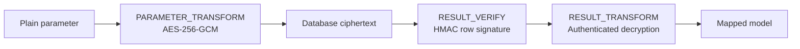

# Security model

The alpha security slice keeps database values encrypted until result
verification completes.

## Implemented invariants

- Every field encryption uses a random 96-bit nonce and authenticated context.
- Ciphertext embeds a format version and key ID; old keys remain readable during rotation.
- Blind indexes use a dedicated key and bind the table/field context.
- Row signatures use canonical JSON and fail closed on tampering or unknown keys.
- `REJECT_PARTIAL` rejects projections that cannot be verified.
- `DEFERRED_RESIGN` explicitly reports an unverifiable partial projection.
- Old valid signature keys return `VerifiedNeedsResign`.
- Keys are excluded from `Debug` output and zeroized when their owners are dropped.

## SM4/SM3 provider

`Sm4Sm3KeyRing` implements the same `FieldCipher` contract as AES-GCM using a
versioned `gm1.key-id.iv.ciphertext.tag` envelope:

- SM4-CBC with PKCS#7 padding and a fresh random 128-bit IV;
- HMAC-SM3 encrypt-then-MAC over version, key ID, field context, IV and ciphertext;
- constant-time MAC verification before CBC decryption;
- independent encryption, authentication and blind-index keys;
- embedded key IDs for online rotation and old-key reads.

The frozen ddd4j adapter expresses the intended SM4/HMAC-SM3 algorithms but
passes `null` for mode, padding, key and IV. Its current `StringJoiner` and
Base64 path cannot produce a stable default ciphertext fixture. The Rust
provider therefore preserves the algorithm intent while defining a secure,
explicit wire format; it does not claim byte-for-byte compatibility with that
non-executable Java default path.

## Current boundary

AES-256-GCM remains the portable default. SM4/HMAC-SM3 is available when the
deployment requires the ddd4j national-cryptography algorithm profile.
Application code builds a validated chain with
`SecurePipelineBuilder` and installs it through
`RbatisMapper::with_secure_pipeline`. The builder reserves the cryptographic
stages, rejects missing signed-column or decryption policies, and only accepts
custom SQL rewrite or observation interceptors.
