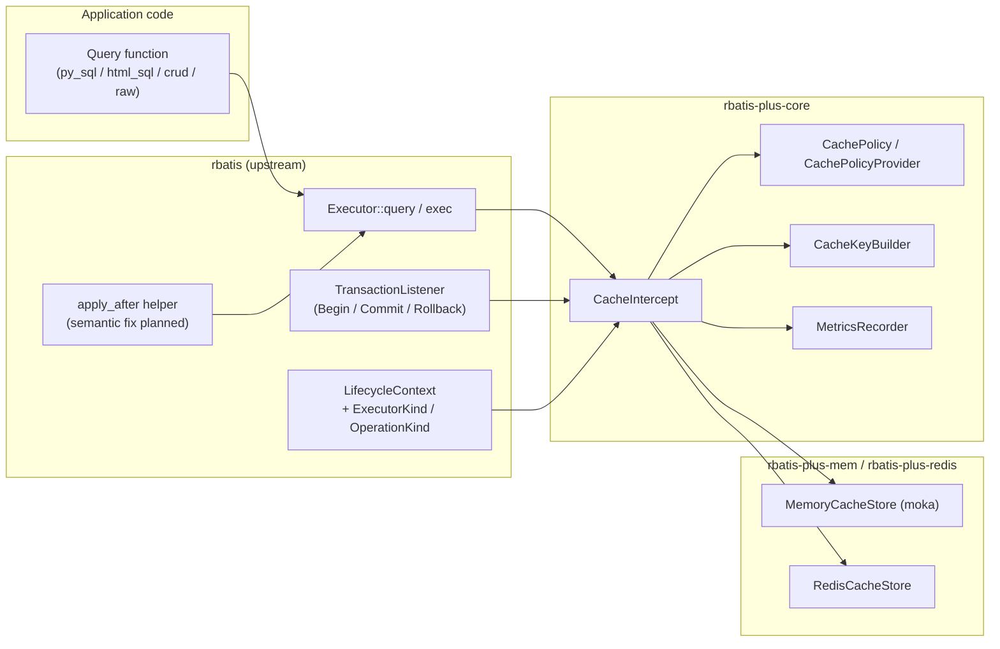
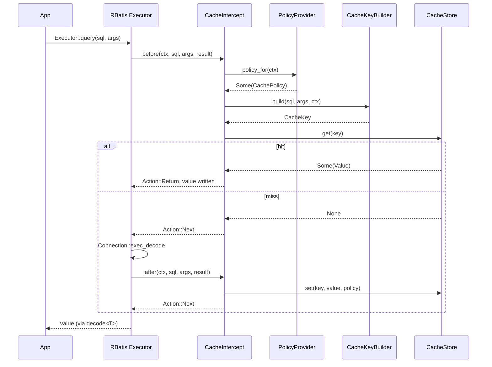
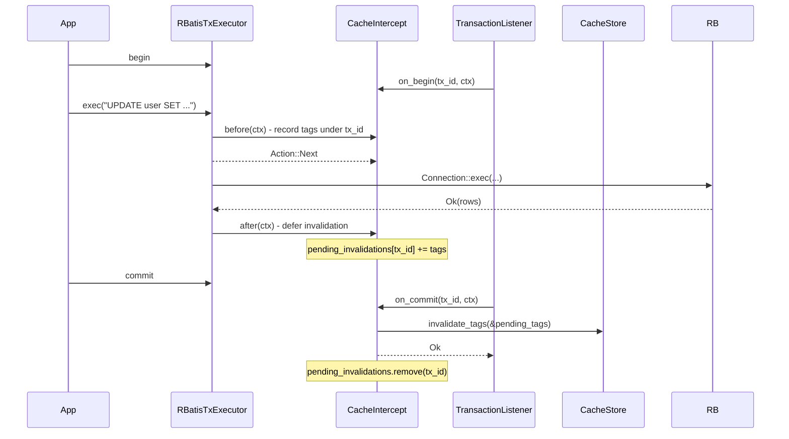
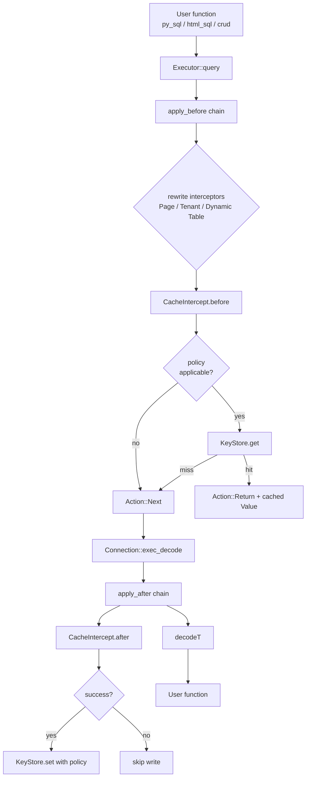
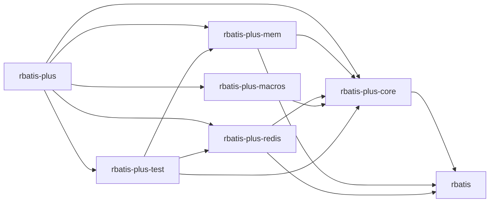

# RBatis-Plus Architecture

> Status: PLANNED — Implementation has not started. All crate names, module
> paths, type names, feature flags, and dependencies in this document are
> proposed designs subject to change before merging upstream or shipping
> RBatis-Plus 0.1.0.

- Date: 2026-07-24
- Upstream baseline (current): RBatis `master` @ `4050edd3dad03a113b8bb4f5818a006f11f2da78`
- Upstream baseline (previous): RBatis `master` @ `2df418feeab511c1899b2a110eef43228a1ad889`
- Latest surveyed commit title: `Limit decode fallback to single-column values`
- CodeGraph current stats (baseline): 178 files, 1,740 nodes, 17,805 edges,
  192 classes, 715 functions, 655 tests; edge breakdown includes 9,366
  `CALLS` and 5,524 `TESTED_BY`; 88 flows, 14 communities.
- Product: RBatis-Plus (separate workspace, planned)
- Companion documents in this folder:
  - [IMPLEMENTATION_PLAN.md](./IMPLEMENTATION_PLAN.md)
  - [RBatis 支持二级缓存调研报告.md](./RBatis%20支持二级缓存调研报告.md)
  - [CACHE_SPECIFICATION.md](./CACHE_SPECIFICATION.md)
  - [TRANSACTION_CONSISTENCY.md](./TRANSACTION_CONSISTENCY.md)
  - [DECISIONS.md](./DECISIONS.md)
  - [INTEGRATION_GUIDE.md](./INTEGRATION_GUIDE.md)
  - [OBSERVABILITY_SECURITY_OPERATIONS.md](./OBSERVABILITY_SECURITY_OPERATIONS.md)
  - [TEST_AND_ACCEPTANCE_PLAN.md](./TEST_AND_ACCEPTANCE_PLAN.md)

## 0. Documentation Index

| # | Document | Role |
| - | --- | --- |
| 0 | [`/README.md`](../README.md) | Project entry, Mermaid diagram, doc index |
| 1 | [`docs/RBatis 支持二级缓存调研报告.md`](./RBatis%20支持二级缓存调研报告.md) | Upstream evidence (RBatis L2 cache investigation) |
| 2 | `docs/ARCHITECTURE.md` | This document; planned layering |
| 3 | [`docs/IMPLEMENTATION_PLAN.md`](./IMPLEMENTATION_PLAN.md) | Phased plan, PR series, test matrix |
| 4 | [`docs/CACHE_SPECIFICATION.md`](./CACHE_SPECIFICATION.md) | Wire protocol: keys, envelopes, codecs, tags |
| 5 | [`docs/TRANSACTION_CONSISTENCY.md`](./TRANSACTION_CONSISTENCY.md) | Transaction semantics, native vs conservative mode |
| 6 | [`docs/DECISIONS.md`](./DECISIONS.md) | Architecture decision records |
| 7 | [`docs/INTEGRATION_GUIDE.md`](./INTEGRATION_GUIDE.md) | Integration gate template |
| 8 | [`docs/OBSERVABILITY_SECURITY_OPERATIONS.md`](./OBSERVABILITY_SECURITY_OPERATIONS.md) | Observability / security / ops |
| 9 | [`docs/TEST_AND_ACCEPTANCE_PLAN.md`](./TEST_AND_ACCEPTANCE_PLAN.md) | Acceptance plan |

---

## 1. Overview

RBatis-Plus is a thin, opt-in layer on top of RBatis that delivers a complete
ORM L2 (result) cache product. Its design obeys one boundary principle,
recorded here so every later decision can reference it:

> **Generic, reusable hooks live upstream in `rbatis`. The complete cache
> product — backends, integrations, batteries, defaults — lives in
> RBatis-Plus.**

Concretely:

- `rbatis` exposes only context types, lifecycle events, and helper functions
  usable by any plugin (cache, tracing, metrics, audit, tenant routing).
- `rbatis-plus-*` crates implement the cache product: `CacheStore`, the policy
  model, key builder, in-process backend, Redis backend, declarative macros,
  test helpers, and admin helpers.
- The user enables the cache by installing `CacheIntercept` after the rewrite
  interceptors. Nothing is on by default.

The plan deliberately **enhances `Executor` + `Intercept` + `rbs::Value` + `py_sql`**
rather than rebuilding the ORM. The latest CodeGraph evidence (see §1.3
below) confirms:

- `Executor` is a unified query/exec path across all four executor types, so
  one intercept mount covers `py_sql`, `html_sql`, raw queries, and CRUD.
- `crud!` is built atop `py_sql!`, so enhancements to the `py_sql` path
  automatically propagate to CRUD.
- `html_sql` carries the highest CodeGraph criticality; we therefore
  prioritize and validate changes on `py_sql` first.
- The macro driver returns a return-token string containing `ExecResult`,
  and the executor recognises which branch to take from a type token
  string. Cache code must respect both token conventions rather than rely
  on type-erased dispatch.

### 1.1 Architecture in one diagram



### 1.2 Mental model

For every query that flows through `Executor::query`:

1. SQL-rewriting interceptors run first (Page, Tenant, Dynamic Table).
2. `CacheIntercept` runs next. On hit, it returns `Action::Return` with the
   cached `rbs::Value`. On miss, it lets the request fall through.
3. `apply_after` (after the planned fix) propagates the latest
   `result` so a `Return` in `after` does not revert.
4. On a miss path, `CacheIntercept::after` writes the `Value` into
   `CacheStore::set` with the configured policy.
5. For DML, `CacheIntercept` records pending invalidations and either fires
   them immediately (non-tx) or holds them (tx), with commit/rollback events
   supplied by upstream `TransactionListener`.

### 1.3 Upstream evidence summary

Latest CodeGraph on `master@4050edd3dad03a113b8bb4f5818a006f11f2da78`
(commit title: `Limit decode fallback to single-column values`):

- **178 files, 1,740 nodes, 17,805 edges**, 192 classes, 715 functions,
  655 tests; 9,366 `CALLS`, 5,524 `TESTED_BY`, 88 flows, 14 communities.
- The RBatis workspace layers cleanly into `runtime / macro-driver /
  codegen / rbdc`. Cache code that touches `Executor` therefore covers
  py_sql, html_sql, raw queries, and CRUD without per-macro patches.
- **`Executor` is the unified path.** `RBatis`, `RBatisConnExecutor`,
  `RBatisTxExecutor`, `RBatisTxExecutorGuard` all funnel through the
  same `apply_before / apply_after` chain.
- **CRUD is built on `py_sql`.** All CRUD queries go through the `py_sql`
  pipeline; caching that pipeline covers CRUD automatically.
- **`html_sql` is the highest-criticality macro flow.** Changes here must
  be conservative and validated on `py_sql` / CRUD first.
- **Macro driver string conventions matter.** The macro emits a return
  token string containing `ExecResult`; the executor recognises the
  branch from a type token string. Cache code must read both tokens,
  not collapse them.
- **`PageIntercept` uses shared maps keyed by executor id.** Cache
  ordering (rewriters before observers) is mandatory; otherwise
  different pages share one key.
- **`RBatisConnExecutor::begin` consumes the connection.** Cloning an
  executor and then calling `begin` on a stale clone can fail because
  the inner `Arc<Mutex<Box<dyn Connection>>>` has been moved into the
  transaction. The planned `TransactionListener` must attach to the
  original executor, not to a clone.
- **Transaction lifecycle is not exposed to `Intercept`.** `commit` /
  `rollback` bypass the interceptor chain, so a transaction-lifecycle
  hook boundary has to be added in upstream for production-grade
  consistency.

These findings reinforce the boundary: **enhance `Executor` + `Intercept` +
`rbs::Value` + `py_sql`** rather than rebuild the ORM.

---

## 2. Layers

### 2.1 Upstream: hook layer (`rbatis`)

Purpose: give plugin authors a generic, typed view of what is happening
without baking any specific feature (cache, tracing, etc.) into core.

Planned additions:

| Symbol                       | Location                              | Purpose                                                  |
| ---------------------------- | ------------------------------------- | -------------------------------------------------------- |
| `ExecutorKind`               | `src/plugin/intercept/mod.rs`         | Root, Connection, Transaction, TransactionGuard          |
| `OperationKind`              | same                                  | Query, Exec, Begin, Commit, Rollback, SavePoint          |
| `LifecycleContext`           | same                                  | Bundled view of `task_id`, executor, datasource, tx id   |
| `CacheHint`                  | same                                  | Default, Bypass, Refresh                                 |
| `apply_lifecycle`            | same                                  | Mirror of `apply_before` / `apply_after`                 |
| `Intercept::ctx` (defaulted) | same                                  | Optional `LifecycleContext` provider                     |
| `TransactionListener`        | same                                  | Begin / Commit / Rollback / SavePoint callbacks          |
| `RBatis::listeners`          | `src/rbatis.rs`                       | SyncVec of `Arc<dyn TransactionListener>`                |

These are the only planned additions in upstream. Each one is reusable by any
plugin author; none references the cache product.

### 2.2 Cache-core layer (`rbatis-plus-core`, planned)

Purpose: types and algorithms reusable across backends.

Planned types:

| Type                    | Notes                                                               |
| ----------------------- | ------------------------------------------------------------------- |
| `CachePolicy`           | TTL, tags, transaction mode, failure mode, null/cache, size limits  |
| `CachePolicyProvider`   | Trait, returns a `CachePolicy` for each query/exec context           |
| `CacheKey`              | Opaque bytes, constructed by `CacheKeyBuilder`                      |
| `CacheKeyBuilder`       | Hasher + namespace + datasource; deterministic                      |
| `CacheIntercept`        | Implements upstream `Intercept` and `TransactionListener`           |
| `MetricsRecorder`       | Trait; `NoopMetricsRecorder` default                                |
| `CacheError`            | Distinct error type; mapped into upstream `Error` at the boundary   |
| `StaticPolicyProvider`  | Reference implementation of `CachePolicyProvider`                   |

### 2.3 Backend layer (`rbatis-plus-mem`, `rbatis-plus-redis`, planned)

Purpose: implement `CacheStore` against concrete storage.

| Backend             | Storage                       | Features                                                       |
| ------------------- | ----------------------------- | -------------------------------------------------------------- |
| `MemoryCacheStore`  | `moka::future::Cache`         | TTL/TTI, capacity, singleflight, tag versions, in-process      |
| `RedisCacheStore`   | `redis::aio`                  | Cross-process, Pub/Sub invalidation, jitter, singleflight      |

Both implement a common planned trait in `rbatis-plus-core`:

```rust
// planned
#[async_trait]
pub trait CacheStore: Send + Sync + Debug {
    async fn get(&self, key: &CacheKey) -> Result<Option<Value>, CacheError>;
    async fn set(&self, key: CacheKey, value: Value, policy: &CachePolicy) -> Result<(), CacheError>;
    async fn remove(&self, key: &CacheKey) -> Result<(), CacheError>;
    async fn invalidate_tags(&self, tags: &[CacheTag]) -> Result<u64, CacheError>;
    async fn clear_namespace(&self, ns: &str) -> Result<u64, CacheError>;
}
```

### 2.4 Optional macro layer (`rbatis-plus-macros`, planned)

Purpose: declarative ergonomics on `py_sql!` / `html_sql!`. Out of scope for
0.1.0; recorded here so the upstream hooks carry the metadata.

Planned attribute example:

```rust
// planned
#[rbatis_plus::cache(
    namespace = "user.profile",
    ttl = "60s",
    tags = ["user", "profile:by_id"],
    key_by = ["id"],
)]
#[py_sql("select * from user where id = #{id}")]
async fn find_user_profile(id: i64) -> rbs::Value { /* ... */ }
```

---

## 3. Component Walkthrough

### 3.1 `CacheIntercept` lifecycle



Key properties (planned):

- `before` reads only. If `CacheHint::Bypass` or `TransactionCacheMode::Bypass`
  is active, it returns `Next` immediately.
- `after` writes only on successful query.
- A short-circuit by any other interceptor never reaches `after`. Pending
  state is cleaned by an inner `tokio::task_local!` registry (planned) so the
  absence of an `after` call does not leak state.

### 3.2 Transactional writes



Properties (planned):

- Reads inside a transaction default to `Bypass`, never see uncommitted data,
  and never leak uncommitted data to other transactions.
- Writes collect tags; commit fires them, rollback discards them.
- If `commit` itself fails, no invalidation runs (planned).
- The `pending_invalidations` map is per-`tx_id` and bounded by
  transaction count.

### 3.3 External writes

External writers (other services, admin scripts) bypass RBatis. We do not
assume they exist; we assume they may. The architecture exposes three layers:

1. TTL bounds staleness.
2. Optional Redis Pub/Sub fan-out for invalidation messages.
3. Manual admin helpers (`RBatisPlusAdmin::invalidate_tags`) for operators.

A future CDC adapter is out of scope (see
[IMPLEMENTATION_PLAN §1.2](./IMPLEMENTATION_PLAN.md)).

---

## 4. Cache Key Design

### 4.1 Inputs

A `CacheKey` is computed from:

| Field              | Source                                              |
| ------------------ | --------------------------------------------------- |
| protocol version   | constant, bumps on wire-incompatible change          |
| namespace          | from policy                                         |
| datasource id      | from `LifecycleContext::datasource_id`              |
| driver             | from `LifecycleContext::driver`                     |
| key prefix         | optional policy attribute                           |
| final SQL          | post-rewriting, post-tenant rewriting               |
| args               | canonical `rbs::Value` encoding                     |
| tenant id          | from `LifecycleContext::tenant_id`                   |
| shard value        | from `LifecycleContext::shard_value`                |

The hash function (planned) is `blake3` for `MemoryCacheStore` and
`blake3` again on the Redis wire envelope with a stable JSON canonicalization
for the args.

### 4.2 Type-safety in args

`1`, `"1"`, `1.0`, `NULL` must produce distinct keys. The canonicalizer
records:

- the variant tag of the `rbs::Value`,
- for `Ext` / `Decimal` / `Timestamp`, the type id,
- for arrays and maps, ordering is preserved as received from the user post-
  rewrite.

We deliberately do not use `Debug` strings: they are unstable across versions.

### 4.3 What never enters a key

- credentials,
- raw JWT,
- raw session tokens.

The API does not silently redact. Users opt in to a planned attribute
`key_redact = ["password"]` (Phase 5) which prevents those args from being
included.

---

## 5. Invalidation Model

### 5.1 Two strategies

| Strategy   | When                                                     | Cost                          |
| ---------- | -------------------------------------------------------- | ----------------------------- |
| Conservative (planned default for `CachePolicy` w/o tags) | any successful DML clears the namespace         | O(capacity of namespace) |
| Versioned tags                                              | tags bumped to a new integer; old keys age out | O(1) on bump, O(capacity) TTL drain |

Both backends use the versioned-tags strategy when at least one tag is set,
because it is O(1) at write time and O(capacity) only at the TTL horizon.

### 5.2 Tag version map

```text
version:tag:<namespace>:<tag>   -> u64     (atomic counter)
value key:                     -> <CacheKey> TTL bound
```

Reading:

```text
effective_key = hash(version:tag values || sql || args || ctx)
```

Invalidating:

```text
INCR version:tag:<namespace>:<tag>
PUBLISH <prefix>.bus InvalidateTags { tags, nonce }
```

Read paths then produce a new hash with the new version and naturally miss;
the old value ages out via TTL.

### 5.3 Boundary note

The cache product does **not** ship a SQL parser. If a user has DML whose
target tables are not captured by a tag, they must use the conservative
namespace strategy or attach tags manually.

---

## 6. Concurrency Model

### 6.1 Singleflight (planned)

Per-key `tokio::sync::Mutex<HashMap<CacheKey, Arc<Notify>>>` keyed by `CacheKey`.

- First miss registers an entry and queries the database.
- Concurrent misses for the same key `await` the same `Notify`.
- The first miss writes the value to the store and notifies.

Capacity is bounded; eviction uses LRU on the waiters map. The exact capacity
is configurable.

### 6.2 Write-write races

- `set` is atomic via Moka's `insert` (planned) or `Redis SET` (planned).
- Tag invalidation is atomic via `INCR` (planned).

A read of `v1` followed by a tag bump to `v2` followed by a `set(v1)` race
window is closed by versioning: subsequent reads compute `v2` and never see
the late `set`. A late `set` under the old version is harmless because no
future read produces that hash.

### 6.3 Failure semantics

| Situation                                | Default                                |
| ---------------------------------------- | -------------------------------------- |
| Backend unreachable                      | `FailOpen` (planned); WARN metric     |
| Backend slow                             | Tokio `timeout` per call (planned)     |
| Decode failure from cached payload       | Treat as miss; ignore entry           |
| Corrupted envelope                       | Treat as miss; WARN metric            |
| Commit failure                           | Tags NOT invalidated, planned          |
| Rollback failure                         | Tags discarded, planned                |

---

## 7. Data Flow Cross-Layer



The diagram is per-query; transaction paths differ only in the in-tx bypass
and commit/rollback fan-out discussed in §3.2.

---

## 8. Crate Map (Planned)

```text
rbatis-plus/
├── rbatis-plus/                meta-crate, re-exports
├── rbatis-plus-core/           policy, key builder, intercept, listener glue
├── rbatis-plus-mem/            in-process backend
├── rbatis-plus-redis/          distributed backend (optional feature)
├── rbatis-plus-macros/         declarative annotations (Phase 5, TBD)
└── rbatis-plus-test/           test fixtures and helpers (no runtime role)
```

Dependency direction (planned):



No crate depends on `rbatis-plus-redis` unless the user opts in. No backend
crate depends on another backend crate. `rbatis-plus-test` is **not** a
runtime backend; it provides shared fixtures, deterministic clocks, and
fake `CacheStore` implementations for cross-crate tests.

---

## 9. API Surface (Planned Snapshot)

These tables list every public type or function the user is expected to
touch. Types marked **planned** do not exist yet. The list is exhaustive for
the 0.1.0 milestone; everything else is internal.

### 9.1 Re-exported by `rbatis-plus` (planned)

| Item                | Origin                  | Purpose                              |
| ------------------- | ----------------------- | ------------------------------------ |
| `CacheIntercept`    | `rbatis-plus-core`      | The `Intercept` implementation       |
| `MemoryCacheStore`  | `rbatis-plus-mem`       | Default backend                      |
| `RedisCacheStore`   | `rbatis-plus-redis`     | Optional backend                     |
| `CachePolicy`       | `rbatis-plus-core`      | Per-query configuration              |
| `CachePolicyProvider` | `rbatis-plus-core`    | Resolver trait                       |
| `StaticPolicyProvider` | `rbatis-plus-core`   | Reference implementation             |
| `KeyHasher`         | `rbatis-plus-core`      | Hash algorithm trait                 |
| `MetricsRecorder`   | `rbatis-plus-core`      | Metric sink                          |
| `NoopMetricsRecorder` | `rbatis-plus-core`    | Default no-op                        |
| `RBatisPlusAdmin`   | `rbatis-plus-core`      | Programmatic admin                   |
| `test::FakeCacheStore` | `rbatis-plus-test`   | Test-only in-memory backend          |
| `test::DeterministicClock` | `rbatis-plus-test` | Test-only clock injection            |

`rbatis-plus-test` is **not** a runtime backend; it is a separate crate
for shared fixtures and is not re-exported by the meta-crate's `prelude`
unless the user enables the `test-support` feature (planned).

### 9.2 Planned constructor patterns

```rust
// planned
let store = MemoryCacheStore::builder()
    .max_capacity(50_000)
    .ttl(Duration::from_secs(60))
    .build()
    .await?;

let policy = StaticPolicyProvider::new(
    CachePolicy::default()
        .namespace("user.profile")
        .ttl(Duration::from_secs(60))
        .tags(["user"])
);

rb.install(CacheIntercept::new(
    Arc::new(store),
    Arc::new(policy),
    Arc::new(NoopMetricsRecorder),
));
```

```rust
// planned, Redis
let store = RedisCacheStore::builder()
    .url("redis://127.0.0.1:6379/")
    .key_prefix("rbatis:l2")
    .pub_sub(true)
    .jitter(Duration::from_millis(500))
    .build()
    .await?;
```

### 9.3 Planned admin API

```rust
// planned
pub struct RBatisPlusAdmin { /* ... */ }

impl RBatisPlusAdmin {
    pub async fn invalidate_tags(&self, tags: &[CacheTag]) -> Result<u64, CacheError>;
    pub async fn clear_namespace(&self, ns: &str) -> Result<u64, CacheError>;
    pub async fn dump_diagnostics(&self) -> DiagnosticsReport;
}
```

`DiagnosticsReport` is planned to include counts, hit ratio, pending tx count,
backend latency percentiles.

---

## 10. Dependencies (Planned)

Lockfile values are TBD; names are recorded so version pinning can be planned.

| Crate              | Depends on                              | Reason                                |
| ------------------ | --------------------------------------- | ------------------------------------- |
| `rbatis-plus-core` | `rbatis` (path or git), `tokio`, `async-trait`, `blake3`, `thiserror`, `tracing` (opt) | SPI, hashing, errors            |
| `rbatis-plus-mem`  | `rbatis-plus-core`, `moka` 0.12 (planned), `dashmap`, `parking_lot` (planned)       | Bounded cache + tag index        |
| `rbatis-plus-redis`| `rbatis-plus-core`, `redis` 0.27 (planned), `tokio`, `rand`                          | Async Redis client + jitter      |
| `rbatis-plus`      | all of the above (re-export only)                                                       | Single import path               |

No crate brings a new async runtime. Tokio is the assumed executor; users on
a different runtime get a compile-time-friendly error (planned message).

---

## 11. Compatibility and Versioning

- Upstream RBatis stays source-compatible through Phases 0-3. Phase 5 macros
  bring new types but not new generated code shapes.
- RBatis-Plus 0.x.y uses semver-with-care: any change to `CacheKey` byte
  layout, the envelope codec, or the `CachePolicy` defaults is a minor bump.
- Pre-1.0 versions may rename items; major-version-style bumps apply.

---

## 12. Failure and Edge Cases (Planned Behaviour)

| Case                                                    | Behaviour                                                      |
| ------------------------------------------------------- | -------------------------------------------------------------- |
| Two-process Redis with clock skew                       | Time is not used in the key; TTL enforced server-side           |
| A user changes the `CachePolicy::ttl` mid-deployment    | New TTL applies on next `set`; existing keys keep old TTL      |
| A tag is removed from policy                            | Old keys age out via TTL; nothing to do                         |
| A user calls `clear_namespace` while a tx is committing | Invalidation runs after `commit` (planned, ordering is by lock) |
| Backend returns an old codec version                    | Treat as miss; emit `envelope_version_mismatch` metric         |
| Application compiled against RBatis-Plus 0.1.0 with newer upstream | Compile error: workspace pins enforce alignment         |

---

## 13. Operational Posture

### 13.1 Default observability

The cache product does not ship an exporter. It exposes:

- counters via `MetricsRecorder`,
- structured fields via `tracing` (feature `tracing`, planned).

Users wire their own exporter. This avoids dependency lock-in.

### 13.2 Suggested metrics (planned names)

- `cache.hit.total`
- `cache.miss.total`
- `cache.store.error.total{reason}`
- `cache.invalidate.tag.total`
- `cache.pending.invalidations{op=commit|rollback}`
- `cache.singleflight.waiters`
- `cache.envelope.version.mismatch.total`

---

## 14. Migration Notes (Planned)

When upstream changes land, external plugin authors must:

1. Update any code reading `Intercept::ctx` (planned default impl returns
   `None`; switch to `Intercept::ctx` once present).
2. Re-run interceptor-ordering tests (planned: included in upstream
   `tests/`).
3. If they relied on `apply_after` returning `before_result` for a `Return`,
   they get the new semantic only after enabling the planned feature
   `fix-after-return-semantic`.

When moving from 0.1.x to 0.2.x the planned change is the addition of
`tenant_id`, `shard_value`, and `statement_id`. Existing keys must be
flushed manually because their hash inputs change.

---

## 15. Diagrams Index

| Diagram                          | Location                          |
| -------------------------------- | --------------------------------- |
| Section 1.1 architecture map     | above                             |
| Section 3.1 query sequence       | above                             |
| Section 3.2 transaction sequence | above                             |
| Section 7 data flow              | above                             |
| Section 8 crate map              | above                             |

All diagrams are written in Mermaid; a future contributor may convert them
into `docs/diagrams/*.mmd` files for offline rendering.

---

## 16. Cross-Reference with the Research Report

| Research report finding                            | Plan location                                                       |
| -------------------------------------------------- | ------------------------------------------------------------------- |
| `apply_after` semantic bug                         | [IMPLEMENTATION_PLAN §4.1 / §3.2](./IMPLEMENTATION_PLAN.md)         |
| Interceptor order matters                          | [§3.1](#31-cacheintercept-lifecycle)                                |
| `task_id` is unreliable                            | [§2.1](#21-upstream-hook-layer-rbatis)                              |
| No transaction events                              | [§2.1](#21-upstream-hook-layer-rbatis)                              |
| Tags/versioned invalidation                        | [§5.2](#52-tag-version-map)                                         |
| Singleflight, jitter, fail-open                    | [§6](#6-concurrency-model)                                          |
| Backend split policy                               | [§2.3](#23-backend-layer-rbatis-plus-mem-rbatis-plus-redis-planned) |
| Keys from final SQL only                           | [§4.1](#41-inputs)                                                  |

---

## 18. MyBatis 对照参考

> MyBatis 3 是 RBatis 的设计原型。CodeGraph 扫描结果：
> 1,807 个类、6,075 个函数、88 个执行流、51 个社区、19,675 条 `TESTED_BY` 关系。
> RBatis 的 `Executor + Intercept + rbs::Value + py_sql` 路径已经具备 MyBatis 核心执行能力。
> RBatis-Plus 在该路径之上扩展 MyBatis-Plus 风格能力，不复刻 Java 反射层。
> 本节仅作对照参考，所有 RBatis-Plus 能力均标注为 planned/TBD。
> MyBatis 行号引用本地代码：`/Users/wandl/workspaces/workspace-github/mybatis-3/src/main/java/org/apache/ibatis/...`。
> RBatis 行号引用本地代码：`/Users/wandl/workspaces/workspace-github/rbatis/src/...`。

### 18.1 执行入口

| MyBatis 机制 | MyBatis 关键位置 | 当前 RBatis 等价 | RBatis-Plus planned |
|---|---|---|---|
| `Executor` 接口 | `Executor.java:32-67` | `Executor` trait 在 `rbatis/src/executor.rs:16-26` | 维持一致 |
| `CachingExecutor` 装饰器 | `CachingExecutor.java:38-46, 84-109` | 由 `Intercept` 链近似 | 计划 `rbatis-plus-mem` / `rbatis-plus-redis` 装饰 `Executor` |
| `BaseExecutor.localCache`（L1） | `BaseExecutor.java:54-72, 132-174` | 进程内 L1 暂无 | 计划 `MemoryCacheStore` |
| `CachingExecutor.tcm`（L2 + 事务） | `CachingExecutor.java:117-131` | L2 暂无 | 计划 `CacheStore` + `TransactionListener` |
| L1 清理 on update | `BaseExecutor.update` 行 110-118 | `Intercept::after` 间接 | 计划 `CacheIntercept` 在 `before` 失效 |

### 18.2 拦截器

| MyBatis 机制 | MyBatis 关键位置 | 当前 RBatis 等价 | 备注 |
|---|---|---|---|
| `Interceptor` trait | `Interceptor.java:22-32` | `Intercept` trait 在 `rbatis/src/plugin/intercept/mod.rs:67-98` | 行为面 RBatis 更简洁 |
| `Plugin` 动态代理 + `Signature` | `Plugin.java:30-63` | 编译期 trait，无运行期反射 | RBatis 优势 |
| `InterceptorChain.pluginAll` | `InterceptorChain.java:23-39` | `SyncVec<Arc<dyn Intercept>>` | 顺序契约已在 §3.1 锁定 |
| 仅代理 4 个接口 | `Invocation.java` 行 33-46 | 拦截 `Executor` 全部方法 + DML/Query | RBatis 拦截面更广 |
| `apply_after` 语义 | `apply_after` 行 131-155 | 已计划 `fix-after-return-semantic` | 见 §4.1 兼容矩阵 |

### 18.3 Mapper 绑定

| MyBatis 机制 | MyBatis 关键位置 | 当前 RBatis 等价 | 备注 |
|---|---|---|---|
| `MapperProxy` | `MapperProxy.java:34-74` | 过程宏直接展开 | RBatis 在编译期消除代理 |
| `MapperProxyFactory` | `MapperProxyFactory.java:47` | 宏生成 `pub fn` | 编译期生成 |
| `MapperMethod` | `MapperMethod.java:46-103` | 宏展开后内联 | 编译期生成 |
| `SqlCommand` | `MapperMethod.java:217-269` | 字符串判断返回类型 | 见 §3.1 风险 |
| `MethodSignature` | `MapperMethod.java:271-384` | 过程宏 `find_return_type` | RBatis 等价 |

### 18.4 Statement 调度

| MyBatis 机制 | MyBatis 关键位置 | 当前 RBatis 等价 | 备注 |
|---|---|---|---|
| `BaseStatementHandler` | `BaseStatementHandler.java:38-71` | `RBatisConnExecutor` + rbdc | 边界由 rbdc 承担 |
| `RoutingStatementHandler` | `RoutingStatementHandler.java:34-55` | `rbdc::Connection::exec_decode` | rbdc 内部路由 |
| `ParameterHandler` | `DefaultParameterHandler.java:75-103` | `rbs::value` | RBatis 一体化 |
| `ResultSetHandler` | `DefaultResultSetHandler.java:80-105, 210-245` | `rbs::Value` → `decode<T>` | 同上 |

### 18.5 配置与构建

| MyBatis 机制 | MyBatis 关键位置 | 当前 RBatis 等价 | 备注 |
|---|---|---|---|
| `XMLConfigBuilder` | `XMLConfigBuilder.java:113-130, 197-206` | 无 XML 加载 | RBatis 通过 `RBatis::init` |
| `XMLMapperBuilder` | `XMLMapperBuilder.java:117-129` | 无 XML Mapper | RBatis 通过 `py_sql!`/`html_sql!` |
| `XMLStatementBuilder` | `XMLStatementBuilder.java:70-83, 129-153` | 宏驱动编译 | RBatis 编译期生成 |
| `MapperBuilderAssistant` | `MapperBuilderAssistant.java:201-229` | 过程宏 | RBatis 优势 |

### 18.6 对 RBatis-Plus 的直接启示

- `CachingExecutor` 模型可直接翻译为 `CachingExecutor(BaseExecutor(SimpleExecutor/ReuseExecutor/BatchExecutor))`。
- `TransactionalCache` 的两阶段提交思想应映射到 `commit-success` 后应用 `pending invalidation`。
- 拦截器仅代理 4 个接口的限制在 RBatis 不存在，RBatis-Plus 可在更广的拦截面提供 `CacheIntercept + Tenant + Audit + Trace`。
- `MapperProxy` 动态代理不需要在 Rust 中复刻，过程宏 + trait 已是同等能力且零运行期开销。
- 反射层（`MetaObject`/`Reflector`/`TypeHandlerRegistry`）在 Rust 中部分回退到 `rbs::Value` + 编译期反射。

---

## 19. Open Questions (Tracked)

1. Whether to expose `KeyHasher` as a trait in 0.1.0 or freeze `blake3`.
2. Singleflight waiter cap default (planned: 1024).
3. `MismatchPolicy` for envelope version mismatch: `FailOpen` vs
   `FailClosed` (planned: `FailOpen` with metric).
4. Whether `TransactionCacheMode::Defer` should be permitted to read in-tx
   (planned: `Bypass` for reads; `Defer` only for invalidations).

---

## 18. Change Log

| Date       | Author | Change                                                                                |
| ---------- | ------ | ------------------------------------------------------------------------------------- |
| 2026-07-24 | TBD    | Initial architecture drafted from the research baseline; all APIs labelled planned.   |
