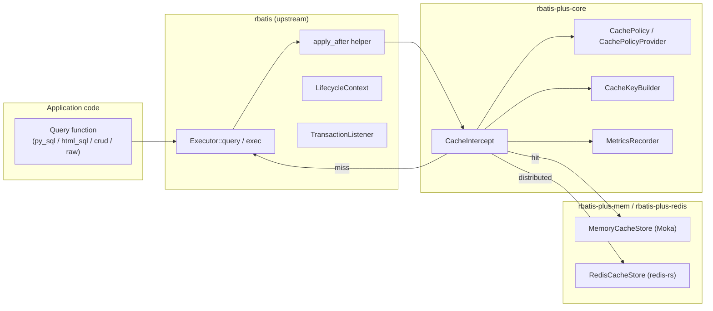
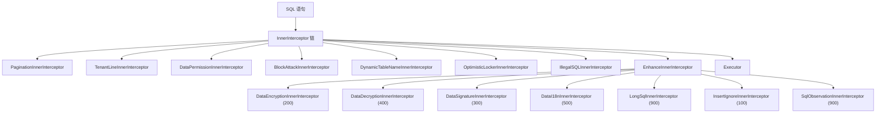
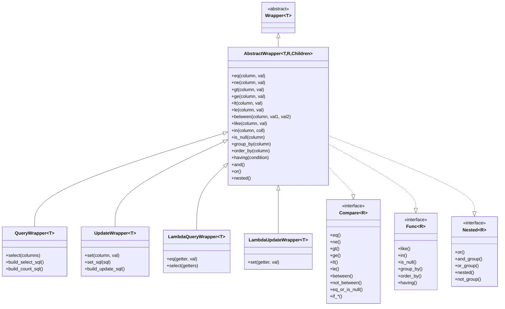

# RBatis-Plus 架构规范

- **日期**：2026-07-20
- **状态**：已实施（部分进行中）
- **对标**：mybatis-plus 3.5.x + mybatis-plus-enhance 2.0.x + mybatis-3 3.6.0
- **上游基线**：RBatis `master` @ `4050edd3dad03a113b8bb4f5818a006f11f2da78`

---

## 1. 目标与范围

RBatis-Plus 是 RBatis 之上的薄层可选增强，交付完整的 ORM L2（结果）缓存产品。设计遵循一个边界原则：

> **通用、可复用的钩子放在上游 `rbatis`。完整的缓存产品——后端、集成、电池、默认值——放在 RBatis-Plus。**

具体而言：
- `rbatis` 只暴露上下文类型、生命周期事件和辅助函数，可供任何插件使用（缓存、追踪、指标、审计、租户路由）
- `rbatis-plus-*` crates 实现缓存产品：`CacheStore`、策略模型、Key 构建器、进程内后端、Redis 后端、声明式宏、测试辅助、管理辅助
- 用户通过安装 `CacheIntercept` 启用缓存，放在重写拦截器之后。默认什么都不开

---

## 2. 总体架构



---

## 3. 模块结构

### 3.1 rbatis-plus（facade crate）

仅做 re-export，不包含业务逻辑。

```rust
// src/lib.rs
pub use rbatis_plus_core::*;
pub use rbatis_plus_extension::*;
pub use rbatis_plus_macros::*;
pub use rbatis_plus_generator::*;
pub use rbatis_plus_sqlparser::*;
pub use rbatis_plus_vernal::*;
```

### 3.2 rbatis-plus-core（核心引擎）

| 模块 | 职责 | 对标 Java |
|---|---|---|
| `conditions/` | 条件构造器（QueryWrapper/UpdateWrapper/Lambda*） | `mybatis-plus-core/.../conditions/` |
| `derive/` | 16 个 derive trait 定义 | `mybatis-plus-annotation/` |
| `mapper/` | BaseMapper trait | `mybatis-plus-core/.../mapper/` |
| `metadata/` | TableInfo/TableFieldInfo | `mybatis-plus-core/.../metadata/` |
| `method/` | 13 个 AbstractMethod 子类 | `mybatis-plus-core/.../injector/methods/` |
| `page.rs` | Page<T> + PageRequest | `mybatis-plus-core/.../page/` |
| `toolkit/` | ReflectionKit / SqlScriptUtils / SqlUtils | `mybatis-plus-core/.../toolkit/` |
| `cache/` | 缓存子系统（iter6 删本地复刻） | `mybatis-plus-core/.../cache/` |

### 3.3 rbatis-plus-macros（过程宏）

独立 proc-macro crate，实现 16 个 derive 宏：

| 宏 | 对标 Java 注解 |
|---|---|
| `#[derive(TableName)]` | `@TableName` |
| `#[derive(TableId)]` | `@TableId` |
| `#[derive(TableField)]` | `@TableField` |
| `#[derive(TableLogic)]` | `@TableLogic` |
| `#[derive(Version)]` | `@Version` |
| `#[derive(FieldFill)]` | `@FieldFill` |
| `#[derive(FieldStrategy)]` | `@FieldStrategy` |
| `#[derive(InterceptorIgnore)]` | `@InterceptorIgnore` |
| `#[derive(KeySequence)]` | `@KeySequence` |
| `#[derive(OrderBy)]` | `@OrderBy` |
| `#[derive(EncryptedField)]` | `@EncryptedField` (enhance) |
| `#[derive(EncryptedTable)]` | `@EncryptedTable` (enhance) |
| `#[derive(I18nColumn)]` | `@I18nColumn` (enhance) |
| `#[derive(SignatureField)]` | `@SignatureField` (enhance) |
| `#[derive(TableSignature)]` | `@TableSignature` (enhance) |

### 3.4 rbatis-plus-extension（扩展层）

| 模块 | 职责 | 对标 Java |
|---|---|---|
| `inner/` | 14 个 InnerInterceptor | `mybatis-plus-extension/.../inner/` + enhance |
| `crypto/` | 加解密 | `mybatis-plus-enhance-extension/.../crypto/` |
| `signature/` | 签名/验签 | `mybatis-plus-enhance-extension/.../signature/` |
| `i18n/` | 国际化 | `mybatis-plus-enhance-extension/.../i18n/` |
| `observation/` | SQL 观测 | `mybatis-plus-enhance-extension/.../observation/` |
| `insert_ignore/` | INSERT IGNORE | `mybatis-plus-enhance-extension/.../insert_ignore/` |
| `service/` | IService + ServiceImpl | `mybatis-plus-extension/.../service/` |

### 3.5 rbatis-plus-sqlparser（SQL 解析层）

| 模块 | 职责 | 对标 Java |
|---|---|---|
| `parser/` | SQL 解析器 | `mybatis-plus-jsqlparser/` |
| `rewrite/` | SQL 重写器 | `mybatis-plus-jsqlparser/` |
| `dialect/` | mysql / postgresql / sqlite | `mybatis-plus-jsqlparser/` |

### 3.6 rbatis-plus-vernal（集成层）

| 模块 | 职责 | 对标 Java |
|---|---|---|
| `axum_integration.rs` | Axum 集成 | `mybatis-plus-spring/` |
| `actix_integration.rs` | Actix 集成 | `mybatis-plus-spring/` |
| `sql_runner.rs` | SqlRunner | `mybatis-plus-extension/.../SqlRunner` |
| `state.rs` | AppState | Spring `@Bean` |
| `transaction.rs` | TransactionTemplate | Spring `@Transactional` |

### 3.7 rbatis-plus-generator（代码生成器）

| 模块 | 职责 | 对标 Java |
|---|---|---|
| `template/tera.rs` | Tera 引擎（FreeMarker 等价） | `mybatis-plus-generator/` |
| `template/handlebars.rs` | Handlebars 引擎（Velocity 等价） | 同上 |
| `template/askama.rs` | Askama 引擎（编译期 JSP 等价） | 同上 |
| `template/maud.rs` | maud 引擎（Twirl/JSX 等价） | 同上 |
| `config/` | DataSource / Package / Strategy / Global | 同上 |
| `query/` | TableInfo 查询 | 同上 |

---

## 4. 拦截器链架构



### EnhancePhase 顺序

| Phase | 值 | 拦截器 |
|---|---|---|
| SQL_REWRITE | 100 | InsertIgnoreInnerInterceptor |
| PARAMETER_ENCRYPTION | 200 | DataEncryptionInnerInterceptor |
| DATA_SIGNATURE | 300 | DataSignatureInnerInterceptor |
| RESULT_DECRYPTION | 400 | DataDecryptionInnerInterceptor |
| RESULT_I18N | 500 | DataI18nInnerInterceptor |
| OBSERVATION | 900 | LongSqlInnerInterceptor / SqlObservationInnerInterceptor |

---

## 5. 条件构造器架构



---

## 6. 缓存架构

### 6.1 缓存键构建

```text
CacheKey = version:namespace:datasource_id:driver:key_prefix:hash(sql, args, ctx)
```

- `version`: 协议版本号（每次 wire-incompatible 变更递增）
- `namespace`: 语义命名空间（如 "user.profile"）
- `datasource_id`: 数据源标识
- `driver`: 驱动名称
- `key_prefix`: 可选前缀
- `hash`: blake3(sql + args + ctx)

### 6.2 缓存策略

```rust
pub struct CachePolicy {
    pub namespace: String,
    pub ttl: Duration,
    pub null_ttl: Option<Duration>,
    pub refresh_ahead: Option<Duration>,
    pub cache_null: bool,
    pub max_value_size: Option<usize>,
    pub transaction_mode: TransactionCacheMode,
    pub failure_mode: CacheFailureMode,
    pub tags: Vec<CacheTag>,
    pub key_prefix: Option<String>,
}
```

### 6.3 事务缓存模式

| 模式 | 行为 |
|---|---|
| `Bypass` | 事务内读不命中共享缓存（默认，最安全） |
| `Defer` | 事务内 DML 收集标签，提交时失效，回滚时丢弃 |

---

## 7. 命名与组织规则

1. 目录/文件名一律 snake_case
2. 每个 .rs 文件只对应一个 Java 对象
3. `mod.rs` 只做模块声明与 re-export，禁止定义类型/逻辑
4. `lib.rs` 只做 crate 门面，禁止堆放对象
5. Java 多层嵌套包只要求最后一级目录完全对齐
6. 每个文件头部有中文 doc 注释：说明对应 Java 类全限定名、核心职责、与 Java 实现的差异
7. jackson → serde；Spring Boot → axum；ThreadLocal → Arc 共享上下文；CopyOnWriteHashMap → DashMap；CompletableFuture → tokio JoinSet

---

## 8. 依赖引入清单

| Iter | 新增依赖 |
|---|---|
| iter0 | (无新增) |
| iter1 | Inflector, syn/proc-macro2/quote (已), uuid |
| iter3 | mockall (dev) |
| iter4 | validator + validator_derive, rust_decimal |
| iter5 | sqlparser-rs (已), testcontainers-rs (dev), mockito (dev), insta (dev), tokio-stream |
| iter6 | redis-rs, memcache-rs, moka |
| iter7 | tera, handlebars, askama, maud, quick-xml |
| iter8 | axum, tracing + tracing-subscriber, testcontainers-rs (dev) |

---

## 9. 严格禁止

- 在 $HOME 建 git worktree
- compat.rs / 集中式转发
- 动 PR 到 rbatis / mybatis-plus / mybatis-plus-enhance / rbatis-wrapper 上游
- 在单文件内塞入多对象 / 用 wildcard re-export 逃避对象级审计
