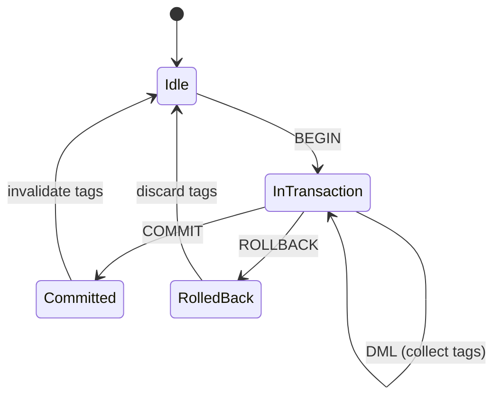

# RBatis-Plus 事务与缓存一致性规范

- **日期**：2026-07-20
- **状态**：目标设计草案（部分已实施）
- **上游基线**：RBatis `master` @ `4050edd3dad03a113b8bb4f5818a006f11f2da78`

---

## 1. 目的与边界

本文定义 RBatis-Plus 二级缓存面对普通执行器和事务执行器时的读、回填、写入失效、提交、回滚与异常语义。

当前仓库尚未向缓存插件提供完整显式事务上下文和可靠的 commit/rollback 生命周期事件。本文中的事件、状态机、类型和 API 都是目标草案；没有这些核心能力时，只能实现本文的**保守模式**，不能宣称满足**原生事务模式**。

---

## 2. 术语与不变量

### 2.1 术语

| 术语 | 定义 |
|---|---|
| **普通操作** | 不属于显式数据库事务的 query/exec |
| **事务操作** | 带可靠 `transaction_id` 且位于 begin 与终态之间的 query/exec |
| **共享 L2** | 可能被其他连接、事务或进程读取的二级缓存 |
| **本地 L2** | 仅当前连接/任务可见的缓存 |

### 2.2 不变量

1. 未提交的写入不得通过共享 L2 对其他连接可见
2. 回滚不得在共享 L2 中留下痕迹
3. 提交后的写入必须在合理时间内对共享 L2 可见
4. 缓存不得放大数据库隔离级别的可见性
5. 缓存不得让数据库本身不提供的隔离语义变得更强

---

## 3. 两种模式

### 3.1 保守模式（Conservative Mode）

**适用条件：** 上游 rbatis 不提供完整事务生命周期事件。

**行为：**
- 事务内所有操作绕过共享 L2
- 事务内不向共享 L2 写入
- 事务内不触发标签失效
- 事务结束后，下次读取通过 TTL 自然过期

**限制：**
- 事务内读取性能退化为无缓存
- 外部写入仍需等待 TTL 过期

### 3.2 原生事务模式（Native Transaction Mode）

**适用条件：** 上游 rbatis 提供完整 `TransactionListener` 事件。

**行为：**
- 事务内读取绕过共享 L2（避免脏读）
- 事务内 DML 收集失效标签到 `DeferredInvalidationMap`
- 提交时：原子递增所有收集的标签版本号
- 回滚时：丢弃所有收集的标签

---

## 4. 状态机



---

## 5. DeferredInvalidationMap

```rust
pub struct DeferredInvalidationMap {
    map: Mutex<HashMap<i64, HashSet<CacheTag>>>,
}

impl DeferredInvalidationMap {
    pub async fn collect(&self, tx_id: i64, tags: Vec<CacheTag>);
    pub async fn commit(&self, tx_id: i64) -> HashSet<CacheTag>;
    pub async fn rollback(&self, tx_id: i64);
}
```

---

## 6. TransactionCacheMode

| 模式 | 行为 | 适用场景 |
|---|---|---|
| `Bypass` | 事务内所有操作绕过共享 L2 | 默认，最安全 |
| `Defer` | 事务内 DML 收集标签，提交时失效 | 需要精确失效 |

---

## 7. TransactionListener 集成

```rust
#[async_trait]
pub trait TransactionListener: Send + Sync {
    async fn on_begin(&self, tx_id: i64, ctx: &LifecycleContext);
    async fn on_commit(&self, tx_id: i64, ctx: &LifecycleContext) -> Result<(), Error>;
    async fn on_rollback(&self, tx_id: i64, ctx: &LifecycleContext);
}
```

### 7.1 CacheIntercept 实现

```rust
#[async_trait]
impl TransactionListener for CacheIntercept {
    async fn on_begin(&self, tx_id: i64, ctx: &LifecycleContext) {
        // 初始化空的标签集合
    }

    async fn on_commit(&self, tx_id: i64, ctx: &LifecycleContext) -> Result<(), Error> {
        // 从 DeferredInvalidationMap 取出标签
        // 原子递增所有标签版本号
        // 清理 map
    }

    async fn on_rollback(&self, tx_id: i64, ctx: &LifecycleContext) {
        // 从 DeferredInvalidationMap 丢弃标签
        // 清理 map
    }
}
```

---

## 8. Guard-Drop 自动回滚

`RBatisTxExecutorGuard` 在 Drop 时自动回滚。`CacheIntercept` 必须确保：

1. Guard-Drop 触发 `on_rollback`
2. 丢弃所有收集的标签
3. 清理 `DeferredInvalidationMap`

---

## 9. 并发事务隔离

- 每个事务有独立的 `tx_id`
- 每个事务的标签集合独立
- 提交时只失效自己的标签
- 两个并发事务的标签不交叉

---

## 10. 测试矩阵

### 10.1 保守模式测试
- [ ] 事务内读不命中共享缓存
- [ ] 事务内不向共享缓存写入
- [ ] 事务结束后 TTL 自然过期

### 10.2 原生事务模式测试
- [ ] 事务内读不命中共享缓存
- [ ] 事务内 DML 收集标签
- [ ] 提交触发标签失效
- [ ] 回滚丢弃标签
- [ ] 同事务多次写入合并标签
- [ ] Guard-Drop 回滚丢弃标签
- [ ] 提交失败不失效标签
- [ ] 两个并发事务独立失效

---

## 11. 已知限制

1. 保守模式下事务内读取性能退化
2. 外部写入仍需等待 TTL 过期（除非使用 Redis Pub/Sub）
3. 不支持跨数据库事务的缓存一致性
4. 不替代数据库隔离级别、锁、幂等、outbox 或分布式事务
